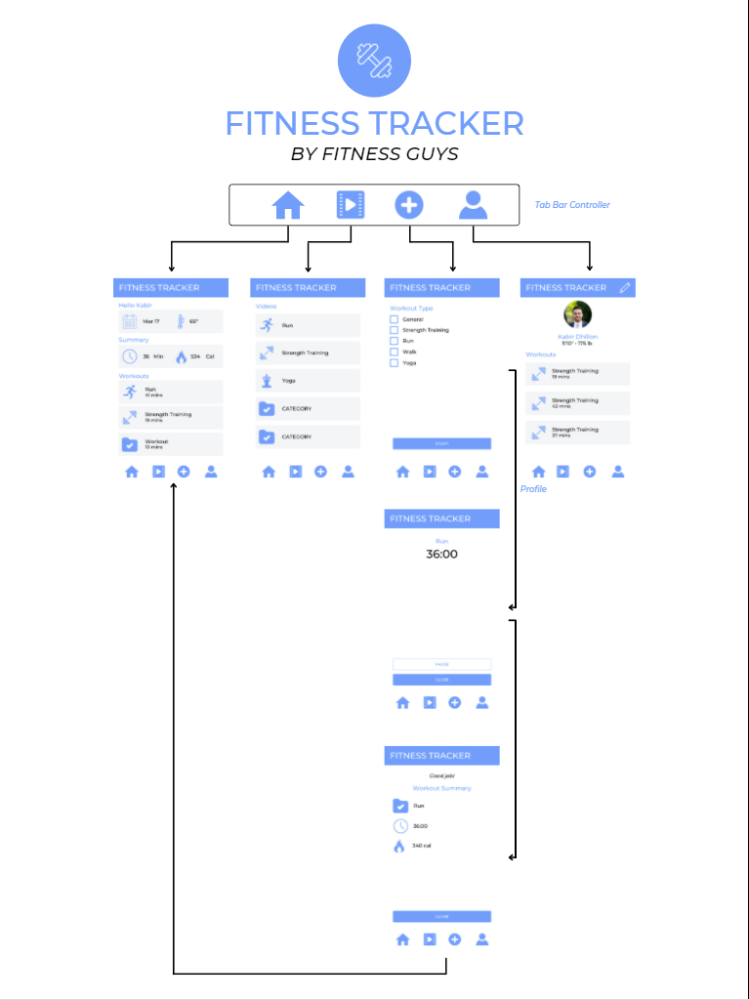

# Fitness Tracker

## Table of Contents
1. [Overview](#Overview)
1. [Product Spec](#Product-Spec)
1. [Wireframes](#Wireframes)
2. [Schema](#Schema)

## Overview
### Description
Allows users to create profiles to track their fitness goals. This is a self reporting fitness app that will allow the user to input their workout history and track their activity. User will be displayed analytics based on the amount of input of workout history recorded into the app. Will also implement tutorial videos section to help users learn new workouts, or even for beginners to get started. A social media aspect of this app will allow users to share with friends and family; while promoting healthy competion and motivating users to work out.


### App Evaluation
[Evaluation of your app across the following attributes]
- **Category:** Fitness 
- **Mobile:** This app would differ from a glorified website by creating a easy to use interface that would quickly provide data to the user
- **Story:** The value on the app will vary on users. The app would be particularly useful for those who like to keep track of their progress. It would also be useful for those who work out frequently. We feel that peers who workout would react positively to this app as it would serve to be a useful tool for them. 
- **Market:** This app will appeal to users who typically like to see their past workouts. Also those who like to track their history and see the progression over time
- **Habit:** Depending on the users workout schedule. The user will be creating data to track their workouts, and the user will also be able to view videos on specific workouts. The user will be able to create posts, so friends could also view thei fitness progress.
- **Scope:** We already have most of the resources to create a barebones version, but the challenging aspect to this is learning how to use new API's and new libraries.

## Product Spec

### 1. User Stories (Required and Optional)

**Required Must-have Stories**
User to sign up
- [x] name, username, password,wt,ht
    
User to login
- [x] username
- [x] password

Profile Screen
- [x] username, ht, weight(maybe?)

User to home screen
- [x] display past days workouts
- [x] display total burned calories over a given duration

Have a workout activity page that will begin to track the users activities. 
- [x] This will have a checkbox for the premade list of exercises. 
- [X] a start/stop button(starts timer)
- [x] Finish button should go to summary
- [x] In summary, calculated calories should be displayed
    
Video tutorials fragment.
- [x] ListView displaying categories.
- [x] Youtube API calls and create model data
- [x] RecyclerView of the videos returning from category query
- [x] Video Playback activity
- [x] Improve astetics of the activities to meet professional look
- [X] Autoplay videos in new activity


In workout screen
- [x] display timer(to calc burned calories)
- [x] display select workout
- [x] workout completed button -> display calorie and time results. W/ a positive message. Close screen back to home page.
 


**Optional Nice-to-have Stories**

* Include a social aspect where the user could post the activities they have completed
* Workout "how to" videos
* Hiking trails (Social workout mode :)
* In Profile: Followers(count) and Follows(count)
* in Home Screen: display workouts from with in friends network

### 2. Screen Archetypes

* Login / Register
    * After Login and Registration, User is then moved to the home screen
* Stream
    * Home screen will be a dashboard interface, that will display certain data such as past workouts and calories burnt
    * A feature where the user could access workout videos. 
    * Social media aspect will display the workout of friends
* Creation
    * The user will be inputing data based on the workout they're completing/tracking. The input will then be saved so that the user could view their progress. 
    * The user will also have the option to post their workouts for others to see. This feature may be presented once the user has finished inputting data from their workout
* Detail
    * This will be used when displaying data to the user, such as calories burned, distance walked, 

* Profile
    * the user will have to create a profile in order to keep track of their progress. The profile activity, will display the users information, and more features may be added during development


### 3. Navigation

**Tab Navigation** (Tab to Screen)

* Login
* Profile
* Home Screen
* Workout Activity
    * workout
* Workout videos


**Flow Navigation** (Screen to Screen)

* Login Screen
    * --> Home
* Registration screen
    * --> Home
* Homescreen
    * --> provide data to the user using a Detail Screen Archetypes once one of the charts get clicked on
    * --> provide the friends feed to the user, might be implemented on another activity

## Wireframes



### [BONUS] Digital Wireframes & Mockups

### [BONUS] Interactive Prototype

## Schema 
[This section will be completed in Unit 9]
### Models
[Add table of models]
### Networking
- [Add list of network requests by screen ]
- [Create basic snippets for each Parse network request]
- [OPTIONAL: List endpoints if using existing API such as Yelp]

## Schema 
### Models
#### User

   | Property      | Type     | Description |
   | ------------- | -------- | ------------|
   | objectId      | String   | unique id for the user post (default field) |
   | author        | Pointer to User| image author |
   | image         | File     | profile image |
   | Weight       | Number   | weight of the user thats inputted during sign up |
   | Height | String   | Height of the user thats inputted during sign up |
   | Password    | String   | Password |
   | Username     | String | username used to sign in |
   | lastWorkout | Pointer to Workout | Date & time of last workout |
   | Email | String | email for user
   | createdAt | DateTime | date and time when profile created
   
#### Workout

   | Property      | Type     | Description |
   | ------------- | -------- | ------------|
   | object ID | String | unique id for the workout
   | createdAt | DateTime | date and time when the workout was initialized
   | start | DateTime | time when the workout was started
   | end | DateTime |time when the workout was completed
   | duration | String | calculated from start and end to display total time of workout
   | WorkoutType | String | name of the specific workout
   | Calories | Number | Carlories burned for the workout
   
#### Date Summary
   | Property      | Type     | Description |
   | ------------- | -------- | ------------|
   | Date | DateTime | The date 
   | Weather | String | Data gathered from weather API
   
#### Current Summary
   | Property      | Type     | Description |
   | ------------- | -------- | ------------|
   | Object ID | String | unique ID for the day Summary
   | TotalDuration | Number | calculated duration of workouts from the same day
   | Calories | Number | calculated Calories of workouts from the same day
   

   
   
### Networking
#### List of network requests by screen
   - Home Screen
      - (Read/GET) Query Date and Weather, total duration, total calories, workouts done sameday
``` java
    Date d = new Date();
    SimpleDateFormat dateForm = new SimpleDateFormat("MM/dd/YY");
    String date = dateForm.format(date);
    Weather weather = new Weather() //Sudo code for weather API call
    ParseQuery<Workout> query = ParseQuery.getQuery(Workout.class);
    query.findInBackground(new FindCallback<Workout>() {
        ....
    })

```


   - User Sign up
``` java

    ParseUser user = new ParseUser();

    user.setUsername("catstevens");
    user.setPassword("space#cowboy");
    user.setEmail("email@example.com");
    user.put("phone", "650-253-0000");
    user.signUpInBackground(new SignUpCallback() {
      public void done(ParseException e) {
        if (e == null) {

        } else {
          // Sign up didn't succeed. Look at the ParseException
          // to figure out what went wrong
        }
      }
    }); 
```

   - Profile Screen
      - (Read/GET) Query logged in user object
      - (Read/GET) Summary of workouts, use graphs too
      - (Update/PUT) Update user profile image
``` java 
    ParseQuery<ParseObject> query =     ParseQuery.getQuery(Workout.class);
    
    // Include the post data with each comment
    query.include("Author"); // the key which the associated object was stored
    
    // Execute query with eager-loaded owner
    query.findInBackground(new FindCallback<ParseObject>()     {
     ....
    }       
          
``` 
      
      
      
      
   - Workout
       - (Create/Post) Create a new Workout Object
``` java
    @ParseClassName("Workout")
    public class Workout extends ParseObject {
   /**objectId 
    * createdAt DateTime
    * start = createdAt
    * end
    * duration
    * workoutType enum - General, Strength, Run, Walk, Yoga
    * calories - calc: Weight- duration- MET
    * 
    * 
    * */
    }

```
     
### Version 1 Progress


### Current Progress


#### [OPTIONAL:] Existing API Endpoints
##### Youtube Data API
- Base URL - [https://www.googleapis.com/youtube/v3/](https://www.googleapis.com/youtube/v3/)

   HTTP Verb | Endpoint | Description
   ----------|----------|------------
    `GET`    | /search | states that we are about to search
    `GET`    | /max   | states the max results, in this case it's 40
    `GET`    | /order | orders the search by relevance
    `GET`    | /"search details" | this is where we input the query keywords for the search

##### Back4App API
- Base URL - [https://parseapi.back4app.com/classes/Workout](https://parseapi.back4app.com/classes)
   HTTP Verb | Endpoint | Description
   ----------|----------|------------
    `POST`    | /classes/Workout | we post to the workout object when the user finishes a workout
    `GET`    | /classes/Workout   | we retrieve the workout data when the user is in home fragment
    `GET`    | /users | we get user details when we are logging in, and the Profile fragment
    `POST`    | /users | we post when the user is signing up for a new profile
    
